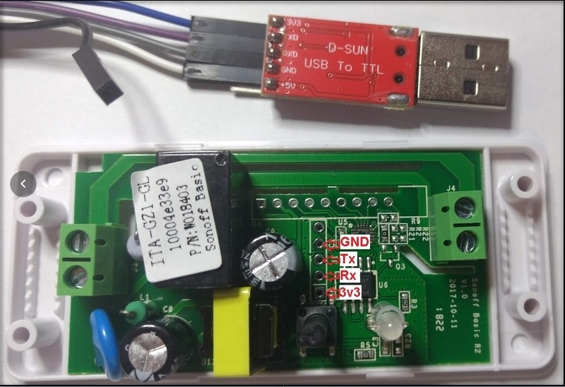

## 2Smart Sonoff Basic
Custom firmware to control the popular Sonoff Basic Wi-Fi relay based on the ESP8285 microcontroller. The device supports full integration with the mobile application [2Smart Cloud](https://2smart.com) on [IOS](https://apps.apple.com/ru/app/2smart-cloud/id1539188825) and [Android](https://play.google.com/store/apps/details?id=com.smart.microcloud.app&hl=ru&gl=US).

With the help of the mobile application, you will be able to:
- connect the device to your account;
- switch the state of the relay;
- receive notifications;
- update the device firmware;
- control the device using voice assistants, telegram bot, phone calls;
- share access to device control with other users through a mobile application or a temporary link.

The device firmware is developed based on the public [2Smart Cloud SDK](https://github.com/2SmartCloud/2smart-cloud-esp8266-boilerplate) for ESP8266.

### Connecting to the mobile application
After installing the firmware on the device, you need to install the mobile application [2Smart Cloud](https://2smart.com) and register. Then find the 2Smart Sonoff Basic device in the device market and follow the connection instructions. 


## How to write firmware on device

1. Need have:  
     `python` (>= v3) installed. You can control it in terminal      
    ```
    python --version
    ```    

    `platformio` (>= v5.1.1)
    ```
    pip install -U platformio
    ```    

2. Have connected device to your computer.




3. Device should be listed in /dev as one of this:

    ```
    (Linux)
    /dev/ttyUSB0

    (OSX)
    /dev/cu.SLAB_USBtoUART
    /dev/cu.usbserial-0001
    ```

4. build and write

    ```
    pio run -t upload
    ```

5. If everything is okay it should start in AP mode and blink once in a second.

If you want just build 
    ```
    pio run 
    ```
If you have error "can't open device "/dev/ttyUSB0": Permission denied" follow Link https://qna.habr.com/q/526674

CLI guide https://docs.platformio.org/en/latest/core/userguide/index.html

